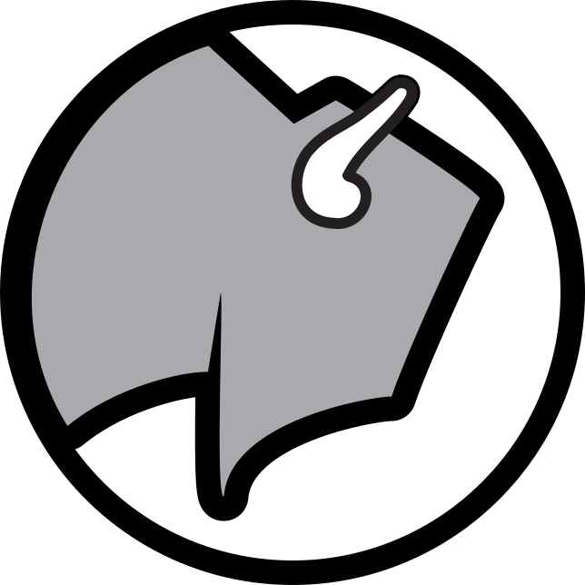

<p align="center">
  
</p>

# Buffalo Dot Graphics

Commercial fleet graphics that turn heads.

This repository contains the source code for the Buffalo Dot Graphics website. The site is built with [Next.js](https://nextjs.org/) 13, TypeScript, Tailwind CSS, and MDX. It showcases our services, portfolio and allows potential clients to get in touch.

## Getting Started

### Prerequisites

- [Node.js](https://nodejs.org/) 18+
- [pnpm](https://pnpm.io/) package manager

### Installation

Install dependencies:

```bash
pnpm install
```

### Development

Start the development server:

```bash
pnpm dev
```

The app will be available at http://localhost:3000.

### Production Build

Create an optimized production build:

```bash
pnpm build
```

Then start the app with:

```bash
pnpm start
```

### Linting

Run ESLint to check code quality:

```bash
pnpm lint
```

## Project Structure

```
.
├── src/               # Application source
│   ├── app/           # Next.js app router pages and layouts
│   ├── components/    # Reusable React components
│   ├── images/        # Image assets
│   ├── lib/           # Utility libraries and data
│   └── styles/        # Global styles
├── public/            # Static files served as-is
├── mdx-components.tsx # Custom MDX components
└── ...
```

## Deployment

The project is set up for deployment on [Vercel](https://vercel.com/). Pushing to the `main` branch triggers a new deployment.

## Contributing

Feel free to open issues or submit pull requests to improve the site.

## License

This project currently has no explicit license. All rights reserved.

